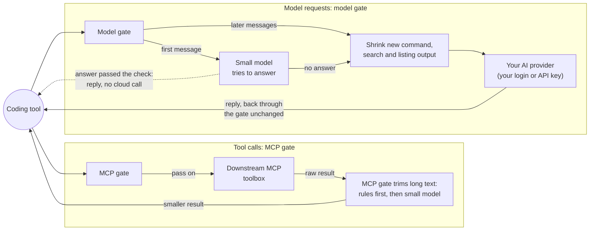
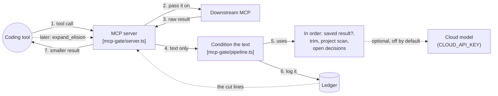
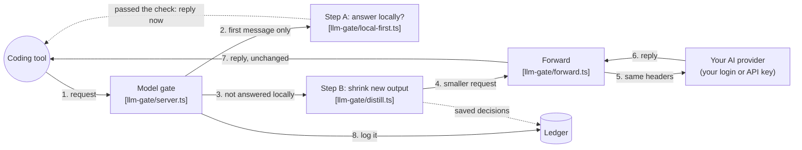
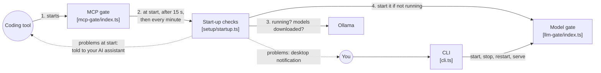
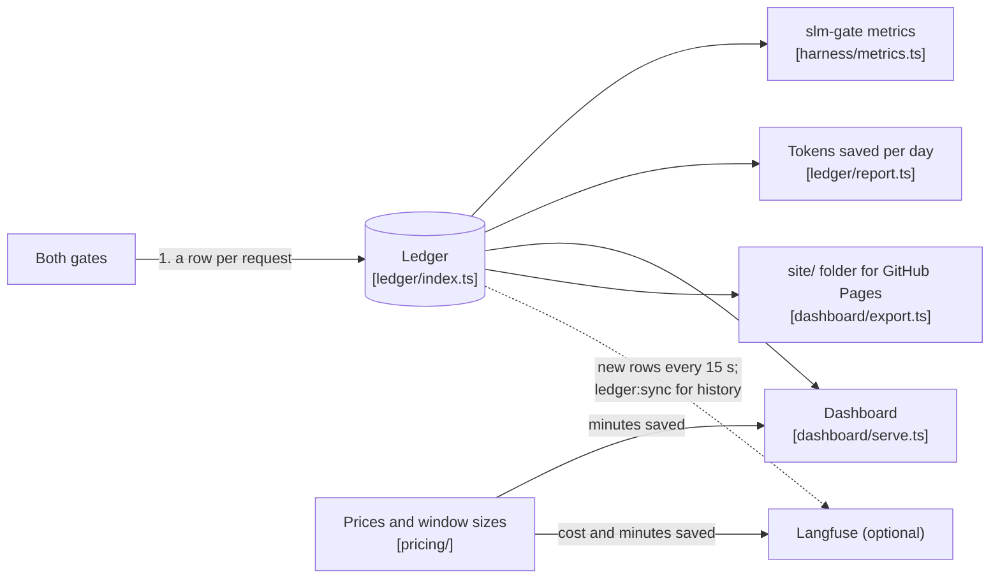

# slm-gate

**Make your AI coding plan last longer.** A small model on your own computer shrinks the large tool output your coding assistant sends to the paid cloud, and answers easy first messages itself. Works with Claude Code, Codex, Cursor, Gemini CLI, Cline and any MCP client. Runs on [Ollama](https://ollama.com/). Free and MIT-licensed.

**[See the live savings dashboard →](https://zenithfoundry.github.io/slm-gate/)** Measured from real daily use; benchmark runs are kept separate.

[](https://github.com/zenithfoundry/slm-gate/actions/workflows/ci.yml)
[](https://github.com/zenithfoundry/slm-gate/actions/workflows/codeql.yml)
[](https://scorecard.dev/viewer/?uri=github.com/zenithfoundry/slm-gate)
[](LICENSE)
[](package.json)
[](https://github.com/zenithfoundry/slm-gate/commits/main)
<br />
[](package.json)
[](tsconfig.json)
[](https://modelcontextprotocol.io/)
[](https://ollama.com/)
[](docs/prerequisites-and-hardware.md)
[](https://zenithfoundry.github.io/slm-gate/)
[](https://github.com/zenithfoundry/slm-gate/pulls)

---

## Table of Contents

1. [What is slm-gate?](#what-is-slm-gate)
2. [How It Works: Visual](#how-it-works-visual)
3. [Quick Start](#quick-start)
4. [Documentation](#documentation)
5. [Contributing & Security](#contributing--security)
6. [Related Project](#related-project)
7. [Intended Use](#intended-use)
8. [License](#license)

---

## What is slm-gate?

`small-language-model-gate` (CLI shortname: **`slm-gate`**) is a **local AI pre-processing and routing layer** that sits in front of your AI coding assistant and quietly does two very useful things before anything reaches the paid cloud:

**It compresses the noise.** Your editor constantly packages up huge files, long logs, and sprawling system instructions and sends them to the cloud AI with every single message. Most of that is content the AI skims past. `slm-gate` intercepts this, runs a small, fast, free AI on your own computer, and strips it down to what actually matters — sending a fraction of the original text to the cloud.

**It answers easy questions locally.** Many conversations open with something a small model can answer — a quick fact, a short explanation, a greeting. `slm-gate` lets your local model try the first message of each conversation; if its answer passes a check, that request never reaches your paid plan at all. Anything else, and every slash command, goes to the cloud as normal.

The result: your paid AI plan lasts dramatically longer. Whether you're on a subscription (Claude Pro, Cursor Pro, Gemini Advanced, ChatGPT Plus) or paying per-token via an API key, you spend far less on the same amount of real work.

### Why You Need This

Every AI subscription comes with rate limits. Claude Pro's five-hour windows, Cursor's monthly turn caps, ChatGPT Plus's hourly message limits — these aren't just numbers. Hit them mid-project and you're waiting hours to continue. `slm-gate` acts as a buffer. By intercepting routine traffic and compressing what does go to the cloud, your effective quota stretches much further.

On pay-per-token API plans (like `gpt-4o` or Claude Sonnet via API key), every token costs money. Sending a 500-line file when the model only needed 30 lines of context is a direct waste of budget. `slm-gate` eliminates that waste automatically.

### Key Benefits

| Benefit | What It Means For You |
| :--- | :--- |
| **Quota Protection** | Fewer turns and tokens consumed means your subscription window lasts longer |
| **$0 Local Execution** | Small, repetitive queries answered free by your local machine |
| **Context Compression** | Large files, logs, and tool responses trimmed intelligently before hitting the cloud |
| **Privacy** | Less of your actual code and data leaves your machine |
| **Provider-Agnostic** | Works with Claude, GPT, Gemini, or any OpenAI-compatible endpoint |

### What Gets Measured: Your Savings Dashboard

`slm-gate` records every decision it makes in a local database file on your computer (a SQLite database — think of it as a simple, fast spreadsheet that lives on your machine). For every request, it logs:

- How many tokens (units of text) were in the original payload
- How many tokens remained after compression
- Whether the request was answered locally (free) or forwarded to the cloud (answering locally is `llm-gate` only; see [How It Operates](docs/integration-layers.md))
- How long the local processing took
- The simulated dollar cost saved (for API key users)

**Checking your savings is one command:**

```bash
pnpm run slm-gate metrics
```

This prints a clean, offline summary showing tokens saved, compression ratio, requests handled locally, and how many extra minutes of subscription headroom you've gained — no API keys, no internet connection required.

**Want a visual dashboard?** Run `pnpm run dashboard` for the built-in one-page dashboard — per-cycle window time returned per provider, tokens saved, weekly charts and routing split, straight from the local ledger, publishable to GitHub Pages for free (see [The Metrics Dashboard](docs/daily-use.md#the-metrics-dashboard)). If you also set up [Langfuse](https://langfuse.com/) (a free, open-source observability tool), `slm-gate` will send traces there for session-by-session analysis. Both are optional — the local metrics command always works regardless.

### How It Works: Visual

Five small diagrams, each answering one question. Read them in order. Numbers on the arrows show the order things happen.

#### 1. The big picture

slm-gate is two small servers on your computer, between your coding tool and the outside world. Both use small local models, run by Ollama:

- **Tool calls** go through the **MCP gate**. It passes each call to your toolbox, then trims long text in the result before your coding tool sees it: fixed rules first, then the small model summarises what is still too long. It also adds a short note on what your project uses, and lists any open decisions it found in the text, answered where it can.
- **Model requests** go through the **model gate**. On the first message of a conversation, the small model may answer by itself, and then the cloud is never called. Otherwise the gate shrinks new command, search and listing output, and sends the request to your AI provider with your own login.

If the small model fails or runs out of time, the text it was working on goes on as it was. Both gates record what they did in a local ledger (diagram 5).



#### 2. What happens to a tool call (MCP gate)

The MCP gate passes each tool call to your downstream toolbox unchanged. When the result comes back, it works on the text only: pictures, structured data and the error flag go back as the toolbox sent them. The gate also adds one tool of its own, `expand_elision`, which fetches back any lines it cut. With no toolbox set, the gate offers a single tool instead, `condition_prompt`, which runs the same steps on text you send it.



| Step | File | What it does |
| :--- | :--- | :--- |
| Saved result | `src/ledger/index.ts`; `src/cache/index.ts` with `SEMCACHE=on` | If the same tool returned the same text before, sends the saved result and skips the steps below. With `SEMCACHE=on`, very similar text counts too. |
| Trim | `src/utils/elision.ts` | Leaves text under `DISTILL_MIN_TOKENS` alone. Otherwise saves the original for `expand_elision`, then cuts by tool name: a file keeps its outline and the lines about the task, a log keeps its errors and last 50 lines, a search keeps its first 50 lines. If it is still over `DISTILL_MAX_TOKENS`, the gate model summarises the plain prose, never code blocks, tables, headings or protected lines (and, by default, never skills or file reads). Anything still too long keeps only its start and end. |
| Project scan | `src/mcp-gate/ground.ts` | Reads the project's root files (`package.json`, `tsconfig.json`, lockfiles, `Cargo.toml`, `go.mod`) and adds a short list of what the project uses. Only when your coding tool shares the project folder. |
| Open decisions | `src/resolver/index.ts` | The brain model lists up to 3 open decisions in the text and answers each from your project's files or common practice; the gate model rates each one's risk. Low-risk answers found in your files are added as decided; the rest are added as questions to ask you, with a suggested answer. With `RESOLVER_CLOUD_TIER=on` and a budget set, unsure ones go to a paid cloud model using `CLOUD_API_KEY`. |

#### 3. What happens to a model request (model gate)

The model gate is a small server at `http://localhost:8787`. It reads four request formats (Anthropic Messages, OpenAI Chat Completions, OpenAI Responses and Gemini) and makes two tries to save you money before anything goes to your AI provider:

- **Step A, answer locally** (first message of a conversation only). Skipped for slash commands, for requests that demand a set output format or a tool call, and, when the coding tool offers the model tools, for messages that mention your code or files or ask about the assistant itself. Otherwise the gate model sorts the question by type, and only simple types are tried: short facts and formatting, plus yes/no, extraction, classification and spelling fixes when no tools are offered. The brain model answers 3 times by default, and the verifier (`src/verifier/index.ts`) rejects an empty answer, a hedging one ("I'm not sure") or answers that disagree. A passing answer goes back in the provider's own format and the cloud is never called. One try at a time, at most 6 seconds. `SEMCACHE=on` also reuses a saved answer to a very similar question, and `ROUTING_TUNE=on` stops trying types that usually fail.
- **Step B, shrink** (every request not answered locally). New command, search and listing output of at least `DISTILL_MIN_TOKENS` is trimmed the same way as in the MCP gate. File reads (including `cat` and similar run from a shell), web fetches and MCP tool results are never changed. Each decision is saved and resent unchanged on every later turn, so the provider's prompt cache keeps working. At most 3 seconds; after that, the original goes.

The request then goes to the provider its address belongs to, with every header your coding tool sent, so your own subscription login or API key is used; slm-gate never adds or swaps credentials. The reply streams back unchanged. Token counts, model lists and hello pings skip both steps.



#### 4. How it starts, and what the CLI does

You rarely start anything by hand. Your coding tool starts the MCP gate. Before the MCP gate answers the tool (it waits at most 1.5 seconds), it starts the model gate in the background if nothing is running on its port, and checks that Ollama is running and every model your settings name is downloaded. It checks again 15 seconds later and then every minute, restarting the model gate if it stopped, unless you stopped it with `slm-gate stop`. With `LLM_GATE_AUTOSTART=off` it never starts the model gate and only checks once. It never starts Ollama or downloads a model. Problems show up as a desktop notification, and problems found at start-up are also passed to your AI assistant. The CLI is for doing this by hand, and for checks and reports.



| Command | Runs | Does |
| :--- | :--- | :--- |
| `start`, `stop`, `restart` | `src/setup/gate-command.ts` | Starts or stops the background model gate; `stop` lasts until `start`, `restart` or a reboot |
| `serve` | `src/llm-gate/index.ts` | Runs the model gate in this terminal (`--layer mcp` or `both` runs the MCP gate too) |
| `doctor` | `src/doctor.ts` | Preflight checks, and the exact line to paste into each coding tool |
| `config` | `src/config.ts` | Prints your settings |
| `models:check` | `src/models/check.ts` | Checks your models are downloaded and fit in memory |
| `metrics` | `harness/metrics.ts` | Rows, tokens and cost in the ledger, gate on vs off |
| `ledger:sync` | `src/ledger/sync.ts` | Sends ledger history to Langfuse |
| `setup-dashboard` | `src/ledger/setup-dashboard.ts` | Builds the Langfuse dashboard |
| `ledger:reset` | `src/cli.ts` | Deletes the local ledger and benchmark output |
| `bench` | `harness/run.ts` | Offline benchmark with an API key (not live traffic) |

#### 5. Where the data goes

Both gates write one row to the local ledger, a SQLite file (`output/ledger.sqlite` by default): one for each tool result the MCP gate conditions, and one for each model request the model gate answers or forwards. A row holds token counts, the route taken and timings, not the text itself. Rows for your coding tool's traffic carry no price; only the optional resolver cloud call and the benchmark record one. Cost saved (from the price list) and minutes saved (from each provider's usage-window size) are worked out for Langfuse as each row is written and again by `ledger:sync`; the dashboard works out minutes saved each time it loads. The same file also keeps saved results, the original of anything cut (for `expand_elision`), and the model gate's shrink decisions.

If all three Langfuse keys are set, each gate sends its new rows there as it runs (at start-up, every 15 seconds and at shutdown), and `ledger:sync` re-sends history.



| Reader | Command | Shows |
| :--- | :--- | :--- |
| Metrics | `slm-gate metrics` | Rows, tokens and cost, gate on vs off |
| Report | `pnpm run ledger:report` | Tokens saved per day and all-time |
| Dashboard | `pnpm run dashboard` | Minutes of each provider's usage window returned, tokens saved, weekly charts, routing split, local-answer accuracy |
| Static copy | `pnpm run dashboard:export` | The dashboard with numbers and dates only, written to `site/` for the Pages workflow |
| Langfuse | runs by itself; `slm-gate ledger:sync` for history | A trace per request, with cost, tokens and minutes saved |

---

## Quick Start

You need Node.js 22+, pnpm 10+ and [Ollama](https://ollama.com/download) running. This is the setup for a 16 GB machine with Claude Code; other editors and machine sizes are in the [setup guide](docs/setup.md).

```bash
git clone https://github.com/zenithfoundry/slm-gate.git small-language-model-gate
cd small-language-model-gate
pnpm install && pnpm run build
cp configs/claude-code/.env.16gb.example .env
ollama pull qwen2.5-coder:3b && ollama pull qwen2.5-coder:0.5b
claude mcp add --scope user slm-gate -- node "$PWD/dist/mcp-gate/index.js"
node dist/cli.js doctor
```

Then restart Claude Code. `doctor` checks Ollama, your models and the model gate, and prints the one line to add to Claude Code's settings if you also want its model requests to go through the gate ([Layer 2](docs/integration-layers.md#layer-2-llm-gate--the-model-endpoint-proxy)).

---

## Documentation

Setup and reference guides live in [`docs/`](docs/README.md). The first time through, read them in this order:

1. [Prerequisites & Hardware Sizing](docs/prerequisites-and-hardware.md): what to install, and which local models fit your machine's memory
2. [How It Operates](docs/integration-layers.md): the two layers, who pays for what, and which coding tools work with each
3. [Step-by-Step Setup](docs/setup.md): clone, build, download models, and connect your editor
4. [Configuration](docs/configuration.md): RAM presets, the 16 GB baseline `.env`, and every setting explained
5. [Verification & Day-to-Day Use](docs/daily-use.md): the health check, fixing start-up problems, checking savings, the dashboard
6. [Architecture & Advanced Features](docs/advanced.md): the hosted small-model fallback, and a rule for contributors

Also: [walkthroughs](docs/README.md#walkthroughs), [analytics & observability](docs/analytics-and-observability.md), [architecture overview](ARCHITECTURE.md), and [every doc on one page](docs/README.md).

---

## Contributing & Security

Pull requests are welcome; read the [contributing guide](.github/CONTRIBUTING.md) first. Please report security problems privately, as the [security policy](SECURITY.md) describes, not in a public issue.

---

## Related Project

> [!NOTE]
> **Tech-Lead-Stack:** An agent-agnostic library of Markdown "skills" plus an MCP
> server that turns Claude, Gemini, or GPT into a full software-delivery team (planning,
> building, review, security, release), organized around a nine-phase lifecycle. Its
> self-correcting Reflexion loop grades implementation plans against four engineering
> pillars before any code is written. `slm-gate` can sit in front of it and shrink its skill payloads.
>
> <a href="https://github.com/bronz3beard/ai.tech-lead-stack" target="_blank" rel="noopener noreferrer">Explore tech-lead-stack on GitHub →</a>

---

## Intended Use

This software runs locally and drives third-party AI tools and models that **you** install and authenticate. You are responsible for complying with the terms of any tool, model, or subscription you connect to it. It is designed for single-user, local use with your own accounts — it does not proxy or share third-party credentials between users. Provided "as is" under the MIT License, without warranty of any kind.

## License

[MIT](LICENSE)
