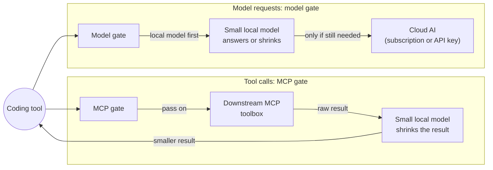
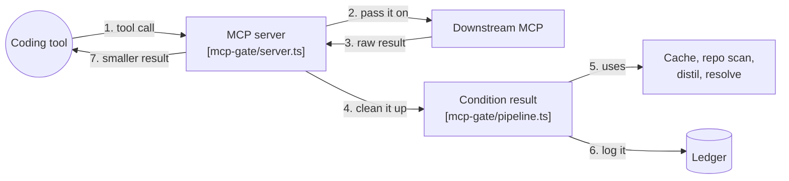
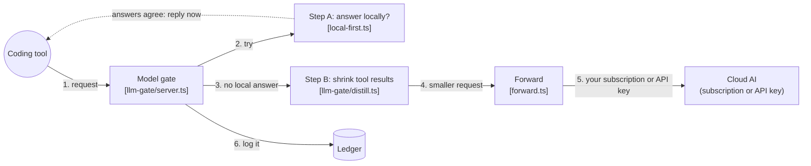
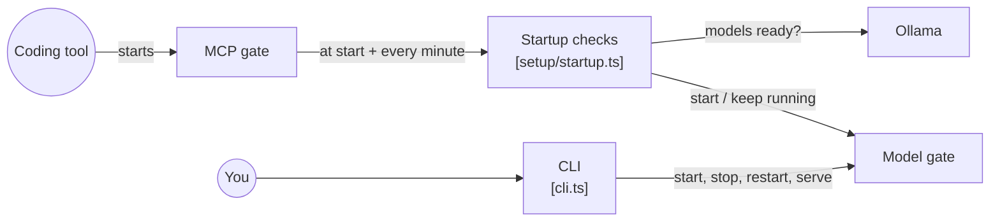
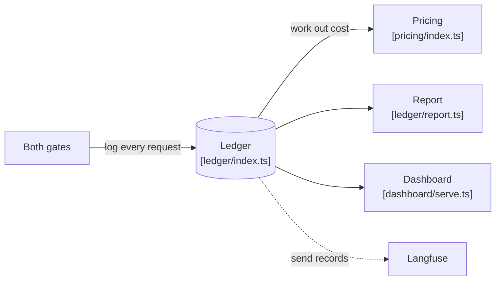

# slm-gate

**Make your AI coding plan last longer.** A small model on your own computer shrinks the large tool output your coding assistant sends to the paid cloud, and answers easy first messages itself. Works with Claude Code, Codex, Cursor, Gemini CLI, Cline and any MCP client. Runs on [Ollama](https://ollama.com/). Free and MIT-licensed.

**[See the live savings dashboard →](https://zenithfoundry.github.io/slm-gate/)** Measured from real daily use; benchmark runs are kept separate.

[](https://github.com/zenithfoundry/slm-gate/actions/workflows/ci.yml)
[](https://github.com/zenithfoundry/slm-gate/actions/workflows/codeql.yml)
[](https://scorecard.dev/viewer/?uri=github.com/zenithfoundry/slm-gate)
[](LICENSE)
[](package.json)
[](https://github.com/zenithfoundry/slm-gate/commits/main)
<br />
[](package.json)
[](tsconfig.json)
[](https://modelcontextprotocol.io/)
[](https://ollama.com/)
[](docs/prerequisites-and-hardware.md)
[](https://zenithfoundry.github.io/slm-gate/)
[](https://github.com/zenithfoundry/slm-gate/pulls)

---

## Table of Contents

1. [What is slm-gate?](#what-is-slm-gate)
2. [How It Works: Visual](#how-it-works-visual)
3. [Quick Start](#quick-start)
4. [Documentation](#documentation)
5. [Contributing & Security](#contributing--security)
6. [Related Project](#related-project)
7. [Intended Use](#intended-use)
8. [License](#license)

---

## What is slm-gate?

`small-language-model-gate` (CLI shortname: **`slm-gate`**) is a **local AI pre-processing and routing layer** that sits in front of your AI coding assistant and quietly does two very useful things before anything reaches the paid cloud:

**It compresses the noise.** Your editor constantly packages up huge files, long logs, and sprawling system instructions and sends them to the cloud AI with every single message. Most of that is content the AI skims past. `slm-gate` intercepts this, runs a small, fast, free AI on your own computer, and strips it down to what actually matters — sending a fraction of the original text to the cloud.

**It answers easy questions locally.** Many conversations open with something a small model can answer — a quick fact, a short explanation, a greeting. `slm-gate` lets your local model try the first message of each conversation; if its answer passes a check, that request never reaches your paid plan at all. Anything else, and every slash command, goes to the cloud as normal.

The result: your paid AI plan lasts dramatically longer. Whether you're on a subscription (Claude Pro, Cursor Pro, Gemini Advanced, ChatGPT Plus) or paying per-token via an API key, you spend far less on the same amount of real work.

### Why You Need This

Every AI subscription comes with rate limits. Claude Pro's five-hour windows, Cursor's monthly turn caps, ChatGPT Plus's hourly message limits — these aren't just numbers. Hit them mid-project and you're waiting hours to continue. `slm-gate` acts as a buffer. By intercepting routine traffic and compressing what does go to the cloud, your effective quota stretches much further.

On pay-per-token API plans (like `gpt-4o` or Claude Sonnet via API key), every token costs money. Sending a 500-line file when the model only needed 30 lines of context is a direct waste of budget. `slm-gate` eliminates that waste automatically.

### Key Benefits

| Benefit | What It Means For You |
| :--- | :--- |
| **Quota Protection** | Fewer turns and tokens consumed means your subscription window lasts longer |
| **$0 Local Execution** | Small, repetitive queries answered free by your local machine |
| **Context Compression** | Large files, logs, and tool responses trimmed intelligently before hitting the cloud |
| **Privacy** | Less of your actual code and data leaves your machine |
| **Provider-Agnostic** | Works with Claude, GPT, Gemini, or any OpenAI-compatible endpoint |

### What Gets Measured: Your Savings Dashboard

`slm-gate` records every decision it makes in a local database file on your computer (a SQLite database — think of it as a simple, fast spreadsheet that lives on your machine). For every request, it logs:

- How many tokens (units of text) were in the original payload
- How many tokens remained after compression
- Whether the request was answered locally (free) or forwarded to the cloud (answering locally is `llm-gate` only; see [How It Operates](docs/integration-layers.md))
- How long the local processing took
- The simulated dollar cost saved (for API key users)

**Checking your savings is one command:**

```bash
pnpm run slm-gate metrics
```

This prints a clean, offline summary showing tokens saved, compression ratio, requests handled locally, and how many extra minutes of subscription headroom you've gained — no API keys, no internet connection required.

**Want a visual dashboard?** Run `pnpm run dashboard` for the built-in one-page dashboard — per-cycle window time returned per provider, tokens saved, weekly charts and routing split, straight from the local ledger, publishable to GitHub Pages for free (see [The Metrics Dashboard](docs/daily-use.md#the-metrics-dashboard)). If you also set up [Langfuse](https://langfuse.com/) (a free, open-source observability tool), `slm-gate` will send traces there for session-by-session analysis. Both are optional — the local metrics command always works regardless.

### How It Works: Visual

Five small diagrams, each answering one question. Read them in order. Numbers on the arrows show the order things happen.

#### 1. The big picture

slm-gate is two small servers on your computer, between your coding tool and the outside world. The small local model (run by Ollama) always comes before the cloud:

- **Tool calls** go through the **MCP gate**. The result from your toolbox is shrunk by the small model before your coding tool sees it.
- **Model requests** go through the **model gate**. The small model gets the first go (answer the request itself, or shrink large tool results), and only what is left goes to the cloud.

The small model only does work when it can help. If there is nothing to do, or it fails, the request carries on unchanged, so slm-gate never blocks you. Both gates log everything to a local ledger (see diagram 5).



#### 2. What happens to a tool call (MCP gate)

The MCP gate passes each tool call to your downstream toolbox unchanged. When the result comes back, it cleans up the text (cuts long output, adds project context, settles unclear points) before your coding tool sees it. Pictures and structured data go back untouched.



| Helper | File | Job |
| :--- | :--- | :--- |
| Cache | `src/cache/index.ts` | Reuses an earlier result for similar text |
| Repo scan | `src/mcp-gate/ground.ts` | Works out the project's stack |
| Distil | `src/utils/elision.ts` | Cuts long output down |
| Resolve | `src/resolver/index.ts` | Asks the small model to settle unclear points |

#### 3. What happens to a model request (model gate)

The model gate makes two tries to save you money before anything goes to the cloud. **Step A:** for the first message of a conversation, the small model answers a few times; if the answers agree (checked by `src/verifier/index.ts`), that answer is sent back and the cloud is never called. **Step B:** otherwise, large tool results the cloud has not seen yet are shrunk, and the request is forwarded to the cloud using whatever your coding tool already uses: your subscription or your API key. slm-gate never adds or swaps credentials.



#### 4. How it starts, and what the CLI does

You rarely start anything by hand. Your coding tool starts the MCP gate. The MCP gate then checks Ollama and your models, and starts the model gate — at start-up and again every minute, so it keeps running. The CLI is for doing this yourself and for checks and reports.



| Command | Runs |
| :--- | :--- |
| `doctor` | `src/doctor.ts` — preflight checks |
| `config` | `src/config.ts` — prints your settings |
| `metrics` | `harness/metrics.ts` — reads the ledger |
| `ledger:sync` | `src/ledger/sync.ts` — sends history to Langfuse |
| `bench` | `harness/run.ts` — offline benchmark (not live traffic) |

#### 5. Where the data goes

Every request both gates handle is written to the local ledger, with its cost worked out from provider prices. The report and the dashboard read from the ledger. If Langfuse is set up, each gate also sends its records there as it runs, and `ledger:sync` sends any older ones.



---

## Quick Start

You need Node.js 22+, pnpm 10+ and [Ollama](https://ollama.com/download) running. This is the setup for a 16 GB machine with Claude Code; other editors and machine sizes are in the [setup guide](docs/setup.md).

```bash
git clone https://github.com/zenithfoundry/slm-gate.git small-language-model-gate
cd small-language-model-gate
pnpm install && pnpm run build
cp configs/claude-code/.env.16gb.example .env
ollama pull qwen2.5-coder:3b && ollama pull qwen2.5-coder:0.5b
claude mcp add --scope user slm-gate -- node "$PWD/dist/mcp-gate/index.js"
node dist/cli.js doctor
```

Then restart Claude Code. `doctor` checks Ollama, your models and the model gate, and prints the one line to add to Claude Code's settings if you also want its model requests to go through the gate ([Layer 2](docs/integration-layers.md#layer-2-llm-gate--the-model-endpoint-proxy)).

---

## Documentation

Setup and reference guides live in [`docs/`](docs/README.md). The first time through, read them in this order:

1. [Prerequisites & Hardware Sizing](docs/prerequisites-and-hardware.md): what to install, and which local models fit your machine's memory
2. [How It Operates](docs/integration-layers.md): the two layers, who pays for what, and which coding tools work with each
3. [Step-by-Step Setup](docs/setup.md): clone, build, download models, and connect your editor
4. [Configuration](docs/configuration.md): RAM presets, the 16 GB baseline `.env`, and every setting explained
5. [Verification & Day-to-Day Use](docs/daily-use.md): the health check, fixing start-up problems, checking savings, the dashboard
6. [Architecture & Advanced Features](docs/advanced.md): the hosted small-model fallback, and a rule for contributors

Also: [walkthroughs](docs/README.md#walkthroughs), [analytics & observability](docs/analytics-and-observability.md), [architecture overview](ARCHITECTURE.md), and [every doc on one page](docs/README.md).

---

## Contributing & Security

Pull requests are welcome; read the [contributing guide](.github/CONTRIBUTING.md) first. Please report security problems privately, as the [security policy](SECURITY.md) describes, not in a public issue.

---

## Related Project

> [!NOTE]
> **Tech-Lead-Stack:** An agent-agnostic library of Markdown "skills" plus an MCP
> server that turns Claude, Gemini, or GPT into a full software-delivery team (planning,
> building, review, security, release), organized around a nine-phase lifecycle. Its
> self-correcting Reflexion loop grades implementation plans against four engineering
> pillars before any code is written. `slm-gate` can sit in front of it and shrink its skill payloads.
>
> <a href="https://github.com/bronz3beard/ai.tech-lead-stack" target="_blank" rel="noopener noreferrer">Explore tech-lead-stack on GitHub →</a>

---

## Intended Use

This software runs locally and drives third-party AI tools and models that **you** install and authenticate. You are responsible for complying with the terms of any tool, model, or subscription you connect to it. It is designed for single-user, local use with your own accounts — it does not proxy or share third-party credentials between users. Provided "as is" under the MIT License, without warranty of any kind.

## License

[MIT](LICENSE)
